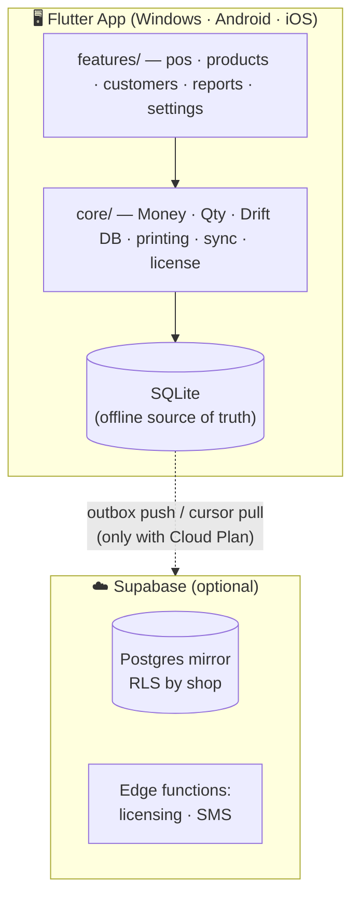

<div align="center">

# 🛒 BechaKena · বেচাকেনা

### The offline-first POS built for Bangladeshi shops

**Sell fast. Track baki. Never lose a sale to load-shedding.**

[](https://flutter.dev)
[](https://dart.dev)
[](https://riverpod.dev)
[](https://drift.simonbinder.eu)
[](#-getting-started)
[](#-development)
[](#)

*by **neWell Software***

</div>

---

## 💡 Why BechaKena?

Most supershops in Bangladesh still run on a paper khata, a calculator, and memory.
The POS software they're offered is foreign, online-only, English-only, and priced
like a monthly bill they never agreed to. **BechaKena is different:**

| 😩 The old way | ✨ With BechaKena |
|---|---|
| Paper baki khata that fades, tears, and gets "forgotten" | 📒 **Digital baki khata** — every customer's due tracked to the paisa, with payment history |
| Hand-written totals, arithmetic mistakes | 🧾 **Branded thermal receipts** with your shop's name — printed in seconds |
| "Internet nei, POS bondho" | 🔌 **100% offline** — every feature works with zero internet, forever |
| Stock counted by walking the aisles | 📦 **Self-maintaining inventory** — every sale and purchase moves stock automatically |
| English-only software the staff can't read | 🇧🇩 **বাংলা-first** — full Bangla/English toggle, ৳ everywhere, lakh-style number grouping |
| Monthly subscription bills | 💸 **One-time license.** Own it. The optional Cloud Plan is exactly that — optional |

> **The 5-minute pitch to any shop owner:** scan a product, take cash, print a
> receipt with *your* shop name on it, and mark ৳50 baki against a customer —
> all before the tea gets cold, all without internet.

---

## 🚀 Features

### 🧾 Point of Sale
- Animated product grid with **live search** — Bangla names, English names, or barcode
- **USB barcode scanner** support (keyboard-wedge, no drivers — the kind every shop in BD already has)
- Fractional quantities for loose goods — sell **250 g of moshla** exactly, no float errors ever
- Per-line and whole-bill discounts, VAT-inclusive pricing (the shelf price is what the customer pays)
- Cash checkout with automatic **change calculation**

### 📒 Baki Khata (Customer Credit)
- Attach any sale to a customer — the shortfall books as due automatically
- Per-customer running balance, derived from immutable records (it can't silently drift)
- Receive payments against dues in two taps
- SMS receipts & due reminders *(roadmap)*

### 📦 Inventory that runs itself
- Stock is **derived from movements** — sales subtract, purchases add, adjustments correct
- Opening stock at product creation; expiry dates on purchase batches
- Low-stock and expiring-soon alerts *(roadmap)*

### 📊 Reports
- Today at a glance: transactions, sales total, new dues
- Date-range sales & profit, top products, VAT summary *(roadmap)*

### 🔒 Built on hard guarantees
- 💰 **All money is integer paisa** — floating-point rounding bugs are structurally impossible
- 🧾 **Finalized sales are immutable** — corrections happen via returns/adjustments, so your books are audit-proof
- 🔄 Every record is **sync-ready** (UUIDv7 + device id) for the multi-device Cloud Plan
- 🌐 Every screen ships in **বাংলা and English** from day one

---

## 🏗 Architecture



- **Offline-first is a hard rule** — the cloud is additive, never required.
- Stock never stored as a number: `stock = SUM(stock_movements.qtyDelta)` — merges conflict-free across devices.
- Full architecture and data model: [`docs/DESIGN.md`](docs/DESIGN.md)

| Layer | Technology |
|---|---|
| UI / App | Flutter 3.44 (one codebase → Windows, Android, iOS) |
| State | Riverpod 3 |
| Routing | go_router |
| Local database | Drift (SQLite) |
| Cloud (optional) | Supabase — Postgres, Auth, Edge Functions |
| Receipts | ESC/POS thermal 58/80 mm — USB, Bluetooth, LAN *(in progress)* |
| Localization | Flutter ARB — `bn` + `en` |

---

## 🏁 Getting Started

### Prerequisites
- [Flutter SDK](https://docs.flutter.dev/get-started/install) ≥ 3.44 (stable)
- **Windows:** Visual Studio with *Desktop development with C++*
- **Linux (dev):** `sudo apt-get install clang cmake ninja-build pkg-config libgtk-3-dev`
- **Android:** Android Studio / SDK

### Build & run

```bash
git clone <repo-url> bechakena && cd bechakena
flutter pub get
dart run build_runner build --delete-conflicting-outputs   # generate Drift/Riverpod code
flutter gen-l10n                                           # generate localizations

flutter run -d windows      # shipping desktop target
flutter run -d linux        # development on Linux
flutter build apk           # Android release
```

### Run the test suite

```bash
flutter analyze   # must stay clean
flutter test      # money math, stock derivation, sales, baki, cart, widgets
```

---

## 📖 Admin Guide

### First-time setup
1. Launch BechaKena — on first run it asks you to **create the owner account** (name + PIN). Everything is offline; no internet or sign-up.
2. Go to **Settings → ভাষা/Language** and choose বাংলা or English.
3. Add your products: **Products → Add product** — name, price (VAT-inclusive), optional barcode and opening stock. Or **Settings → Load sample products** for a ready-made Bangladeshi catalog.

### Staff & PINs
- **Settings → Staff & PINs**: owners and managers can add staff (manager/cashier) each with their own PIN, or remove them.
- Every sale is attributed to the signed-in staff; **Reports** shows a sales-by-staff breakdown.
- **Log out** from Settings returns to the PIN screen — the next cashier signs in with their own PIN.

### Inventory alerts
- The **Inventory** tab lists products at or below their low-stock level and purchase batches expiring within 14 days (already-expired flagged in red).
- Set a product's low-stock level when adding it; expiry dates come from purchase entries.

### Daily selling
| Task | How |
|---|---|
| Add item to bill | Scan barcode · tap product card · type in search and press Enter |
| Change quantity | Use the ➕ / ➖ steppers on the invoice line |
| Take payment | **Pay** → split across **Cash / bKash / Nagad / Card** → change is calculated → **Confirm sale** |
| Print receipt | The receipt preview opens after every sale — hit **Print** (LAN ESC/POS printer, set up in Settings) |
| Sell on baki | In the Pay dialog, pick the **customer** — any shortfall is booked as their due |
| Unlisted item | ➕ icon on the invoice panel → name, price, quantity |

### Baki khata management
- **Customers** tab shows every customer with their live due balance (red when they owe).
- Tap a customer with dues → **Receive payment** → enter the amount. The balance updates instantly.
- Every due and payment is a permanent record — nothing can be quietly edited away.

### Purchases & stock
- **Purchases** tab → **New purchase**: pick the supplier (or add one inline), enter lines with quantity, unit cost, and optional expiry date — stock restocks automatically.
- To correct stock (shrinkage, count fixes), tap any product on the **Products** tab → **Adjust stock** with a signed change and a reason. Every correction is a permanent movement record.

### Printer setup
1. **Settings → Printer**: enter the LAN thermal printer's IP (RAW/JetDirect, port 9100), choose 58 mm or 80 mm paper, **Save**.
2. Hit **Test print** to verify.
3. Receipts print in ASCII with `Tk` amounts — universal across cheap thermal printers; Bangla bitmap headers are on the roadmap. USB (Windows) and Bluetooth (Android) transports are coming next.

### Data & backup
- All data lives in a single SQLite file on the device (`bechakena.db` under the app's data directory).
- **Settings → Backup now** writes a clean snapshot (`BechaKena-backup-<timestamp>.db`) into your Downloads/Documents folder — copy it to a pen drive.
- **Settings → Restore from backup** picks a snapshot; it is applied the next time the app starts.
- **Sales can never be edited after finalization.** Mistakes are corrected with returns/adjustments — this is what makes the numbers trustworthy.

### License & Cloud Plan *(rolling out)*
- One-time license per shop, verified fully offline (signed key bound to the machine).
- Optional Cloud Plan adds encrypted backup, multi-device sync, and the owner's remote app. If it lapses, the POS keeps working locally — **it never locks you out.**

---

## 🧑‍💻 Development

BechaKena is built **test-driven**: the money engine, stock derivation, invoice
numbering, sale finalization, and cart logic all had failing tests before they
had implementations.

```text
lib/
├── app/          # router, theme, top-level providers, brand
├── core/         # Money (integer paisa) · Qty (milli-units) · format (৳, lakh, বাংলা digits)
│   └── db/       # Drift schema (16 tables), DAOs, sale finalization
├── features/     # feature-first: pos · products · customers · reports · settings
└── l10n/         # app_en.arb + app_bn.arb — every string, both languages
```

**Hard rules** (enforced by tests — see [`CLAUDE.md`](CLAUDE.md)):
1. No feature may require network.
2. Money is integer paisa; quantities are integer milli-units. No doubles. Ever.
3. Stock is always derived, never stored.
4. Finalized sales are immutable.
5. Every user-facing string exists in both `bn` and `en`.

---

## 🗺 Roadmap

- [x] Money/Qty engine, ৳ formatting, invoice numbering
- [x] Drift schema + derived stock + atomic sale finalization
- [x] POS screen: grid, search, cart, cash & baki checkout
- [x] Products, Customers (baki khata), Today report, বাংলা/English
- [x] ESC/POS receipt printing over LAN + receipt preview + test print
- [x] Split payments (cash + bKash/Nagad/card)
- [x] Purchases UI with supplier & expiry tracking
- [x] Manual items, stock adjustments, backup/restore
- [x] Analytics dashboard: sales trend, top products, payment split (date ranges)
- [x] Staff PINs & roles, offline login gate, staff-wise sales
- [x] Low-stock & expiring-soon inventory alerts
- [ ] USB/Bluetooth printer transports + Bangla bitmap receipt header
- [ ] SMS receipts & due reminders
- [ ] Licensing + Cloud Plan sync

---

<div align="center">

**BechaKena · বেচাকেনা** — made with ❤️ by **neWell Software** for the shops of Bangladesh 🇧🇩

*One-time price. Yours forever. Online optional.*

</div>
