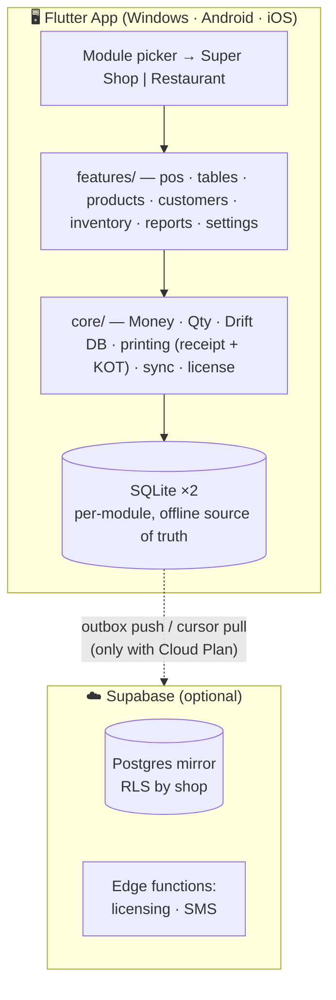

<div align="center">

# 🛒 BechaKena · বেচাকেনা

### The offline-first POS built for Bangladeshi shops — now for restaurants too

**Sell fast. Track baki. Fire the kitchen. Never lose a sale to load-shedding.**

[](https://flutter.dev)
[](https://dart.dev)
[](https://riverpod.dev)
[](https://drift.simonbinder.eu)
[](#-getting-started)
[](#-development)
[](#)

*by **neWell Software***

</div>

---

## 💡 Why BechaKena?

Most shops and eateries in Bangladesh still run on a paper khata, a calculator, and
memory. The POS software they're offered is foreign, online-only, English-only, and
priced like a monthly bill they never agreed to. **BechaKena is different:**

| 😩 The old way | ✨ With BechaKena |
|---|---|
| Paper baki khata that fades, tears, and gets "forgotten" | 📒 **Digital baki khata** — every customer's due tracked to the paisa, with payment history |
| Hand-written totals, arithmetic mistakes | 🧾 **Branded thermal receipts** with your shop's name — printed in seconds |
| "Internet nei, POS bondho" | 🔌 **100% offline** — every feature works with zero internet, forever |
| Stock counted by walking the aisles | 📦 **Self-maintaining inventory** — every sale and purchase moves stock automatically |
| Kitchen orders shouted across a noisy floor | 🍽️ **Restaurant mode** — table tabs, printed kitchen tickets (KOT), settle-the-bill in two taps |
| English-only software the staff can't read | 🇧🇩 **বাংলা-first** — full Bangla/English toggle, ৳ everywhere, lakh-style number grouping |
| Monthly subscription bills | 💸 **One-time license.** Own it. The optional Cloud Plan is exactly that — optional |

> **The 5-minute pitch to any shop owner:** scan a product, take cash, print a
> receipt with *your* shop name on it, and mark ৳50 baki against a customer —
> all before the tea gets cold, all without internet.

---

## 🧭 One app, two businesses

On first launch BechaKena asks **which kind of business you run** — and reshapes
itself to fit. Each module keeps its **own isolated database** (its own staff,
catalog, sales and reports), so a device is never confused about what it's selling.

<table>
<tr>
<th width="50%">🏪 Super Shop / Retail</th>
<th width="50%">🍽️ Restaurant / Café</th>
</tr>
<tr>
<td valign="top">

- Barcode-first product grid
- Cart → cash / bKash / Nagad / card → receipt
- Baki khata (customer credit)
- Purchases, suppliers, expiry batches
- Low-stock & expiry alerts

</td>
<td valign="top">

- Floor of **dining tables** with live tabs
- **Dine-in · Takeaway · Delivery** orders
- Add to a running tab that survives restarts
- **Fire a Kitchen Ticket (KOT)** — only the new items
- **Settle** → same immutable sale engine + receipt

</td>
</tr>
</table>

> Switching modules is one tap (Settings → Switch module) and never touches the
> other module's data.

---

## 🚀 Features

### 🧾 Point of Sale (retail)
- Animated product grid with **live search** — Bangla names, English names, or barcode
- **USB barcode scanner** support (keyboard-wedge, no drivers — the kind every shop in BD already has)
- Fractional quantities for loose goods — sell **250 g of moshla** exactly, no float errors ever
- Per-line and whole-bill discounts, VAT-inclusive pricing (the shelf price is what the customer pays)
- Split checkout across **Cash / bKash / Nagad / Card** with automatic **change calculation**

### 🍽️ Restaurant service
- **Tables view** — see which tables are free, which have a running tab, and the live total on each
- **Running orders** — items persist to the tab as they're added, so it survives navigation and power cuts
- **Kitchen tickets (KOT)** — fire only the newly-added items to the kitchen printer; re-adds start a fresh ticket
- **Order types** — dine-in (by table), takeaway and delivery (by guest name), from one hub
- **Settle** finalizes an immutable sale through the exact same engine as retail — one receipt, one truth

### 📒 Baki Khata (customer credit)
- Attach any sale to a customer — the shortfall books as due automatically
- Per-customer running balance, derived from immutable records (it can't silently drift)
- Receive payments against dues in two taps
- SMS due-reminder templates + local outbox queue (bn/en)

### 📦 Inventory that runs itself
- Stock is **derived from movements** — sales subtract, purchases add, adjustments correct — **per branch**
- Opening stock at product creation; expiry dates on purchase batches
- **Low-stock and expiring-soon alerts** on the Inventory tab
- Supplier purchases with per-line unit cost and expiry

### 👥 Staff, roles & branches
- **PIN login**, fully offline — first run creates the **owner**; owners/managers add managers and cashiers
- **Capability matrix** — a cashier sees only sell + customers; back-office tabs are hidden and deep links are bounced
- Every sale is attributed to the signed-in staff; **Reports** shows a sales-by-staff breakdown
- **Multi-branch/outlet** — stock, sales and orders are scoped per branch

### 📊 Reports
- Today at a glance: transactions, sales total, new dues
- Date-range sales trend, top products, payment-method split, VAT summary
- **Sales history** with receipt reprint; **returns/refunds** against finalized sales

### 🔒 Built on hard guarantees
- 💰 **All money is integer paisa** — floating-point rounding bugs are structurally impossible
- 🧾 **Finalized sales are immutable** — corrections happen via returns/adjustments, so your books are audit-proof
- 🔄 Every record is **sync-ready** (UUIDv7 + device id) for the multi-device Cloud Plan
- 🌐 Every screen ships in **বাংলা and English** from day one

---

## 🏗 Architecture



- **Offline-first is a hard rule** — the cloud is additive, never required.
- Stock never stored as a number: `stock = SUM(stock_movements.qtyDelta)` per branch — merges conflict-free across devices.
- Each business module runs in its **own SQLite file** — physically isolated data, staff and reports.
- Full architecture and data model: [`docs/DESIGN.md`](docs/DESIGN.md)

| Layer | Technology |
|---|---|
| UI / App | Flutter 3.44 (one codebase → Windows, Android, iOS) |
| State | Riverpod 3 |
| Routing | go_router (capability-guarded routes) |
| Local database | Drift (SQLite) — 21 tables, schema v6, per-module files |
| Cloud (optional) | Supabase — Postgres, Auth, Edge Functions |
| Receipts & tickets | ESC/POS thermal 58/80 mm — LAN today; USB/Bluetooth transports built-in (plugin-enabled) + shop-logo raster header + kitchen tickets |
| Localization | Flutter ARB — `bn` + `en` (252 keys, full parity) |

---

## 🏁 Getting Started

### Prerequisites
- [Flutter SDK](https://docs.flutter.dev/get-started/install) ≥ 3.44 (stable)
- **Windows:** Visual Studio with *Desktop development with C++*
- **Linux (dev):** `sudo apt-get install clang cmake ninja-build pkg-config libgtk-3-dev`
- **Android:** Android Studio / SDK

### Build & run

```bash
git clone <repo-url> bechakena && cd bechakena
flutter pub get
dart run build_runner build --delete-conflicting-outputs   # generate Drift/Riverpod code
flutter gen-l10n                                           # generate localizations

flutter run -d windows      # shipping desktop target
flutter run -d linux        # development on Linux
flutter build apk           # Android release
```

### Run the test suite

```bash
flutter analyze   # must stay clean
flutter test      # 167 tests: money math, stock, sales, baki, orders/KOT, permissions, widgets
```

---

## 📖 Admin Guide

### First-time setup
1. Launch BechaKena — first you **pick a module** (Super Shop or Restaurant). This
   choice is remembered and opens that module's own database.
2. A quick **feature tour** runs once, then you **create the owner account** (name + PIN).
   Everything is offline; no internet or sign-up.
3. Go to **Settings → ভাষা/Language** and choose বাংলা or English.
4. Load a catalog:
   - **Restaurant** ships a demo menu automatically on first open.
   - **Retail:** tap **Load demo** on the empty POS, or **Settings → Load sample products**, or add your own via **Products → Add product**.

### Selling — retail
| Task | How |
|---|---|
| Add item to bill | Scan barcode · tap product card · type in search and press Enter |
| Change quantity | Use the ➕ / ➖ steppers on the invoice line |
| Take payment | **Pay** → split across **Cash / bKash / Nagad / Card** → change is calculated → **Confirm sale** |
| Print receipt | The receipt preview opens after every sale — hit **Print** (ESC/POS printer, set up in Settings) |
| Sell on baki | In the Pay dialog, pick the **customer** — any shortfall is booked as their due |
| Unlisted item | ➕ icon on the invoice panel → name, price, quantity |

### Serving — restaurant
| Task | How |
|---|---|
| Open a tab | **Tables** tab → tap a free table (or **Orders** → New takeaway/delivery) |
| Add items | Tap menu cards — each item persists to the tab immediately |
| Fire the kitchen | **Send to kitchen** prints a KOT of only the *new* items; a badge shows how many are unsent |
| Manual/off-menu item | ➕ on the order panel → name, price, quantity |
| Settle the bill | **Settle** → split tender (cash/bKash/Nagad/card) → finalizes an immutable sale + receipt, frees the table |
| Cancel | 🗑 on the order — cancels the tab with no sale side effects |

### Staff, roles & branches
- **Settings → Staff & PINs**: owners and managers add staff (manager/cashier) each with their own PIN.
- Roles are a **capability matrix** — cashiers can sell and manage customers; managers add back-office; owners can do everything.
- **Log out** returns to the PIN screen — the next person signs in with their own PIN.
- **Multi-branch:** add and switch outlets in Settings; stock and sales are tracked per branch.

### Inventory alerts
- The **Inventory** tab lists products at or below their low-stock level and purchase batches expiring within 14 days (already-expired flagged in red).
- Set a product's low-stock level when adding it; expiry dates come from purchase entries.

### Purchases & stock corrections
- **Purchases** tab → **New purchase**: pick the supplier (or add one inline), enter lines with quantity, unit cost, and optional expiry — stock restocks automatically.
- To correct stock (shrinkage, count fixes), tap any product → **Adjust stock** with a signed change and a reason. Every correction is a permanent movement record.

### Printer setup
1. **Settings → Printer**: pick the connection — **LAN / USB / Bluetooth**.
   - **LAN** (recommended, works everywhere): enter the printer's IP (RAW/JetDirect, port 9100).
   - **USB / Bluetooth**: tap **Select device** (needs the native plugin enabled — see [`docs/OPERATIONS.md`](docs/OPERATIONS.md) §6).
2. Choose 58 mm or 80 mm paper, **Save**, then hit **Test print** to verify.
3. Add a **shop logo** in **Settings → Shop profile → Choose logo** — rasterised and printed atop every receipt. Shop name, address, phone and footer print on every invoice.
4. Amounts print as `Tk` — universal across cheap thermal printers.

### Data & backup
- Each module's data lives in its **own SQLite file** under the app's data directory (`bechakena_<module>.db`).
- **Settings → Backup now** writes a clean snapshot into your Downloads/Documents folder — copy it to a pen drive.
- **Settings → Restore from backup** picks a snapshot; it applies the next time the app starts (into *that* module only).
- **Settings → Clear local data** wipes *this module* back to a fresh install — back up first; applies on next launch.
- **Sales can never be edited after finalization.** Mistakes are corrected with returns/adjustments — this is what makes the numbers trustworthy.

> **Full day-to-day operations guide** — demo data, clearing local data, logo/invoice setup, and the optional Cloud Plan (Supabase sync + SMS gateway): [`docs/OPERATIONS.md`](docs/OPERATIONS.md).

### License & Cloud Plan *(rolling out)*
- One-time license per shop, verified fully offline (signed key bound to the machine).
- Optional Cloud Plan adds encrypted backup, multi-device sync, and the owner's remote app. If it lapses, the POS keeps working locally — **it never locks you out.**

---

## 🧑‍💻 Development

BechaKena is built **test-driven**: the money engine, stock derivation, invoice
numbering, sale finalization, running orders/KOT, and the permission matrix all had
failing tests before they had implementations.

```text
lib/
├── app/          # module picker gate, router (capability-guarded), theme, brand
├── core/         # Money (integer paisa) · Qty (milli-units) · format (৳, lakh, বাংলা digits)
│   └── db/       # Drift schema (21 tables), DAOs, sale finalization, orders/KOT, per-module open
├── features/     # feature-first: pos · tables · products · customers · inventory · reports · auth · settings
└── l10n/         # app_en.arb + app_bn.arb — every string, both languages
```

**Hard rules** (enforced by tests — see [`CLAUDE.md`](CLAUDE.md)):
1. No feature may require network.
2. Money is integer paisa; quantities are integer milli-units. No doubles. Ever.
3. Stock is always derived, never stored.
4. Finalized sales are immutable.
5. Every user-facing string exists in both `bn` and `en`.

---

## 🗺 Roadmap

- [x] Money/Qty engine, ৳ formatting, invoice numbering
- [x] Drift schema + derived stock + atomic sale finalization
- [x] Retail POS: grid, search, cart, split cash & baki checkout
- [x] Products, Customers (baki khata), reports, বাংলা/English
- [x] ESC/POS receipt printing over LAN + receipt preview + test print
- [x] Purchases UI with supplier & expiry tracking
- [x] Manual items, stock adjustments, backup/restore
- [x] Analytics dashboard: sales trend, top products, payment split (date ranges)
- [x] Staff PINs & role-based capability matrix, offline login gate, staff-wise sales
- [x] Low-stock & expiring-soon inventory alerts
- [x] Sale returns/refunds + sales history (reprint receipts)
- [x] CSV product import/export
- [x] SMS due-reminder templates + local outbox queue (bn/en)
- [x] Shop-logo raster header on receipts + per-module clear-local-data reset
- [x] USB/Bluetooth printer transports (plugin-enabled) alongside LAN
- [x] **Restaurant module**: dining tables, running tabs, KOT kitchen tickets, takeaway/delivery, settle
- [x] **Multi-branch foundation**: per-branch stock, sales & orders
- [ ] Bangla bitmap text on receipt body
- [ ] Cloud Plan: SMS gateway dispatch, encrypted backup, multi-device sync
- [ ] Ed25519 offline licensing + activation

---

## 📣 Would you buy this? (a note to the community)

We're gauging whether an offline-first POS like this is genuinely *sellable* to
local shops and restaurants in Bangladesh. Here's the short pitch we're floating on
Reddit — copy/adapt it if you want to help us test the waters:

> **Title:** Built an offline-first POS + restaurant billing app for Bangladeshi shops — would owners actually pay for this?
>
> I've been building **BechaKena** (বেচাকেনা — "buying & selling"), a POS that runs
> **100% offline** on a cheap Windows PC, Android tablet or phone. No monthly fee —
> one-time license, and it keeps working during load-shedding / no internet.
>
> It does two things out of one app:
> - **Retail super shops** — barcode billing, **baki khata** (digital customer credit),
>   auto inventory, bKash/Nagad/card split payments, thermal receipts with the shop's own name.
> - **Restaurants/cafés** — table tabs, **kitchen tickets (KOT)** printed to the kitchen,
>   takeaway/delivery orders, settle-the-bill.
>
> Everything is **বাংলা-first** (full Bangla/English toggle, ৳, lakh-style numbers), works
> with the cheap USB barcode scanners and thermal printers shops already own, and the books
> are tamper-proof (finalized sales can't be edited — only refunded).
>
> **My real question for shop/restaurant owners (and anyone who's sold software here):**
> is there a real market for a *one-time-price, offline, Bangla* POS, or has everyone already
> moved to the subscription cloud apps? What would you actually pay for a lifetime license —
> ৳2k? ৳5k? more? And what's the one feature that would make it a no-brainer?
>
> Happy to share a demo build. Not selling anything in this post — genuinely trying to learn
> whether this is worth taking to market. 🙏

**Good places to post & ask:** r/bangladesh · r/dhaka · r/smallbusiness ·
r/software · r/flutterdev (as a build-in-public/tech angle) · local Facebook
groups for dokandars and restaurant owners.

---

<div align="center">

**BechaKena · বেচাকেনা** — made with ❤️ by **neWell Software** for the shops & kitchens of Bangladesh 🇧🇩

*One-time price. Yours forever. Online optional.*

</div>
